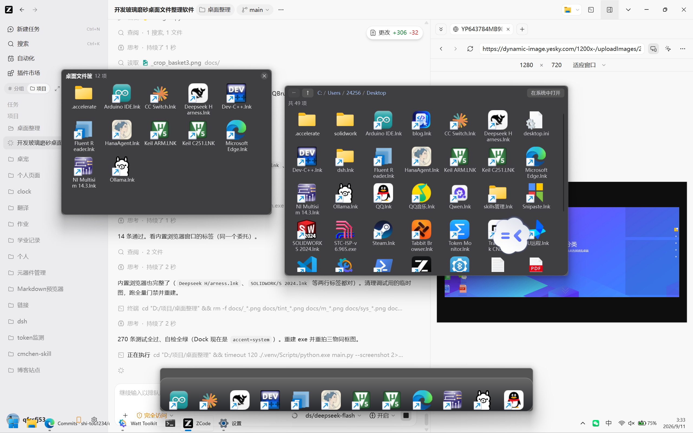

# DeskBasket · 桌面磨砂文件筐

把桌面上散落的文件、文件夹、快捷方式收进几块**玻璃磨砂**的面板里分类摆放；筐里的项目双击就能打开，右键文件夹还能钻进一个内置的"类资源管理器"页面继续逐级往下看。屏幕底部还有一条 **Nexus 式的透明 Dock**，鼠标碰一下屏幕底边就滑出来。程序是一个单文件绿色 exe，支持开机自启。

Windows 11 实测通过（build 26200.9445）。



*截图里三样东西：左边是磨砂文件筐，右边是内置文件浏览器，底部中间是滑出的 Dock（无背景、纯图标浮在桌面上）。*

## 先说最重要的一条：它不动你的文件

**筐只登记文件的绝对路径，绝不移动、删除、改名、改属性。** 桌面上原来的图标、位置、时间戳全都保持原样，筐是一层"分类视图 + 启动面板"，不是收纳盒。

这个设计是被明确选定的（宁可桌面看上去没变干净，也不要程序有机会弄丢文件）。想自己验证一遍：

```bash
.venv/Scripts/python.exe scripts/desktop_snapshot.py dump > docs/desktop_after.json
.venv/Scripts/python.exe scripts/desktop_snapshot.py compare
```

会逐条比对桌面上每个条目的名字、修改时间、大小，任何一项变了都会打印 `DESKTOP_UNCHANGED_FAIL`。

## 功能

- **磨砂筐面板**：无边框圆角窗口，真实 Acrylic 后排模糊（`SetWindowCompositionAttribute`），拖动窗口能看出背后的壁纸被糊开。
- **底部 Dock（照 Nexus 官方观感）**：一条半透明**玻璃承托条**，图标坐在上面。
  - **悬停放大**：鼠标移到哪一项，那一项放得最大（1.45×），左右的邻居按余弦衰减依次变小；名称以深色小药丸形式浮在被悬停图标的正上方，平时不显示、不占地方。
  - 鼠标进屏幕底部 3 像素热区就滑出（180ms 动画），离开 400ms 后自动收起，平时一点屏幕空间都不占；任务栏正在显示时，Dock 会让到任务栏上方，不会两条叠在一起。
  - 自动收录桌面上的 `.lnk` / `.url` / `.exe`；也可以直接把任意文件、文件夹拖进去。
  - 拖动图标即可调整顺序，顺序持久化；右键「从 Dock 移除」只去掉登记，磁盘文件不动，而且**移除过的东西不会再被自动收录加回来**。
  - **前台是全屏程序（视频/游戏/演示）时绝不弹出**；桌面本身和最大化窗口不算全屏，所以最大化浏览器时照样能碰出 Dock。
- **设置面板**：磨砂窗口，改任何一项都立刻生效并落盘——磨砂模式（Acrylic / Blur）、筐内图标大小、筐的改名/显隐/删除、一键清理失效项、Dock 开关与图标大小与收起延迟、开机自启、恢复默认。
  - 配置文件**向后兼容**：第一版写的 `settings.json` 能被直接读入，旧字段一个不丢，不认识的字段也会原样保留。
- **图标与名称**：图标在上、名称在下最多两行（照腾讯桌面整理的样子），长文件名会**均分折行**而不是把第二行裁掉半截。文件筐与内置浏览器共用同一套排版代码，观感一致。
- **拖进去就收纳**：从桌面或资源管理器把文件/文件夹拖到筐上即登记，自动去重（Windows 路径大小写不敏感）。
- **双击打开**：文件走系统默认程序打开；文件夹直接在**内置浏览器窗口**里钻进去。打不开会弹中文提示，绝不静默失败。
- **内置文件浏览器**：磨砂的类资源管理器页面，有可点击的面包屑、"返回"和"上一级"（已经在根目录时置灰），双击文件夹继续深入。只读遍历，零写操作，2000 项以上分批渲染不卡。
- **失效项提醒**：筐里指向的文件被删掉或改名后，条目标灰并在标题旁标注"n 项失效"，右键可一键清理（同样只清数据，不动磁盘）。
- **多筐**：想建几个筐都行，每个筐独立记名字、位置、大小、显隐，配置持久化。
- **开机自启**：写 HKCU 注册表 Run 值（登录时静默启动，不弹黑窗），开/关都幂等。
- **单实例保护**：重复启动会被挡住并提示「已有 DeskBasket 在运行」，避免出现两条 Dock、两套筐，以及两个进程同时写同一份 `settings.json` 互相覆盖。第二次点击图标会把已有窗口亮出来。
- **系统托盘**：显示所有筐、新建筐、显示/隐藏 Dock、设置、开机自启开关、退出。
- **不抢焦点**：筐和 Dock 都带 `WindowDoesNotAcceptFocus` + `WA_ShowWithoutActivating`，点它们不会打断你正在做的事。

## 快速开始

### 用编译好的 exe

```
dist\DeskBasket.exe
```

单文件绿色版，双击即用，不写注册表、不建安装目录（设置存在 `%APPDATA%\DeskBasket\`）。

### 从源码跑

```bash
python -m venv --system-site-packages .venv
.venv/Scripts/python.exe -m pip install PySide6-Essentials pyinstaller pytest
.venv/Scripts/python.exe main.py
```

### 开机自启

```bash
.venv/Scripts/python.exe main.py --autostart on     # 打开
.venv/Scripts/python.exe main.py --autostart off    # 关闭
.venv/Scripts/python.exe main.py --autostart status # 查状态
```

## 命令一览

| 命令 | 作用 |
|---|---|
| `main.py` | 正常启动 |
| `main.py --selftest` | 无显示器自检，退出码 0 表示通过（可配合 `QT_QPA_PLATFORM=offscreen`） |
| `main.py --dock-selftest` | Dock 自检：热区决策、全屏拦截、滑出/收起位置、图标渲染 |
| `main.py --autostart on\|off\|status` | 开机自启开关 |
| `main.py --screenshot [--hold=秒]` | 真机显示筐／浏览器／Dock 后抓整屏到 `docs/screenshot.png` |
| `main.py --visual [--accent=off]` | 自包含的磨砂取证：条纹背板 + 面板，用高频能量比判定模糊是否生效 |
| `main.py --probe [--win-d] [--marker] [--simulate-drop 路径]` | 窗口层级 / 拖入探针 |
| `scripts/desktop_snapshot.py dump\|compare` | 桌面零改动取证 |
| `scripts/window_dump.py [关键字]` | dump 屏幕上所有顶层窗口的样式、层级、命中测试 |
| `scripts/gen_icon.py` | 重新生成 `assets/icon.ico` |

## 实测数据

全部数字来自本机 Windows 11 build 26200.9445，可复跑。

**单元测试**

```
$ .venv/Scripts/python.exe -m pytest tests -rs
270 passed in 3.8s
```

覆盖筐数据模型（去重、失效检测、清理）、设置持久化（坏 JSON 回退、原子写、未知字段保留、旧配置兼容）、拖放解析（中文/空格/百分号编码/盘符/多文件）、目录浏览（面包屑、上级、分批、权限失败、2100 项目录）、图标缓存（内存+磁盘双层）、Dock（热区、全屏拦截、最大化窗口不拦、位置计算、收录白名单、去重、排序持久化）、设置面板（旧配置字段不丢、改一项立刻落盘、恢复默认）、窗口行为（拖入接受与拒绝、根目录置灰、offscreen 降级）。

**自检**

```
$ QT_QPA_PLATFORM=offscreen .venv/Scripts/python.exe main.py --selftest
SELFTEST_OK_probe 460 200
SELFTEST_OK_drop 1
SELFTEST_OK_basket 5
SELFTEST_OK_explorer 5
SELFTEST_OK_settings 1
```

**Dock 自检（真机）**

```
$ .venv/Scripts/python.exe main.py --dock-selftest
DOCK_ICONS 6
DOCK_OK reveal=991 hidden=1067 fullscreen_block=True items=6 accent=off
```

`reveal=991` / `hidden=1067`：逻辑屏高 1067，Dock 高 76（图标 48＋上下留白），滑出后正好贴着屏幕底边、收起后整体移出可视区。`accent=off` 是刻意为之——Dock 不上后排模糊、不铺底色，只让图标浮着。

**打包产物**

```
$ powershell -ExecutionPolicy Bypass -File build.ps1
SELFTEST_OK_probe 460 200
SELFTEST_OK_drop 1
SELFTEST_OK_basket 5
SELFTEST_OK_explorer 5      # 以上为 exe 自检，ExitCode 0
SELFTEST_OK_settings 1
270 passed in 3.8s
DeskBasket.exe 36.6 MB
```

**轻量（这是选 Python＋PySide6 而不是 Electron 的原因）**

```
$ tasklist  →  python.exe   11,180 K       # 工作集 11.2 MB
```

窗口全开（一个筐 + 内置浏览器）、静置 10 秒后测得工作集 11.2 MB、峰值 11.2 MB。Qt 的 DLL 页面是全系统共享的，所以这个数字比 Electron 同场景（通常 150 MB 起）低一个数量级；空闲时不耗 CPU（Dock 的热区轮询是 60ms 一次的纯位置比较，不装全局钩子、不提权）。

**磨砂确实生效（不是靠半透明假装）**

程序里有一项自包含取证：铺一块高对比条纹背板，先抓一张"面板还没显示"的原始条纹图，再把磨砂面板盖上去抓第二张，比较同一块区域的**高频能量**（相邻像素亮度差）。真实模糊会把高频削平，而单纯盖一层半透明底色只是等比缩小——两者的比值有本质区别。

```
$ .venv/Scripts/python.exe main.py --visual
VISUAL_ACCENT system
SHARPNESS_HIDDEN 11.67 SHOWN 0.00 RATIO 0.000 TINT_TRANSMITTANCE 0.69
BLUR_VERDICT BLURRED
```

反向验证（同一命令关掉磨砂，必须报 NOT_BLURRED，证明判据不是恒真）：

```
$ .venv/Scripts/python.exe main.py --visual --accent=off
VISUAL_ACCENT off
SHARPNESS_HIDDEN 11.67 SHOWN 8.01 RATIO 0.687 TINT_TRANSMITTANCE 0.69
BLUR_VERDICT NOT_BLURRED
```

注意 0.687 几乎正好等于面板底色的透光率 0.69——这精确印证了"只压暗不模糊"与"真模糊"是两回事：系统材质下高频被削到 0.000，关掉磨砂后只剩底色等比衰减。

**磨砂用哪套 API：老 API 会渲染成黑块，已换成 Win11 系统材质**

这是第二轮里花时间最多的一处实测。`ACCENT_ENABLE_ACRYLICBLURBEHIND`（网上绝大多数 PyQt 教程用的那套）在这台机器（Win11 build 26200）上会渲染成**近乎不透明的黑块**：

| 配置 | 面板空白区亮度（浅色背景下） |
|---|---|
| 老 API `ACRYLICBLURBEHIND`，面板底色 alpha 0x60 | 17.3 / 255 |
| 同上，面板底色 alpha **0x00**（完全不铺底） | 17.3 / 255（**一模一样** → Qt 自己画的东西被完全盖住） |
| `BLURBEHIND`（模糊模式） | 17.3 / 255 |
| 关掉材质，只留半透明底色 | 156 ~ 192 / 255 |
| **Win11 系统材质**（`DwmExtendFrameIntoClientArea` + 系统背景材质） | **63.7 / 255**（深色烟熏玻璃，背后内容可见且被糊开） |

所以 `acrylic` 模式现在**优先走 Win11 系统材质**，失败才回退老 API，再失败回退纯半透明底色（绝不因为没磨砂就崩）。上表里"面板底色 alpha 0x00 与 0x60 结果完全相同"这一条最能说明问题：老 API 生效时，Qt 画的底色根本参与不到合成里。

取证图：`docs/probe_visual.png`（面板内条纹明显糊开，面板外依旧锐利）。

**开机自启**

```
$ .venv/Scripts/python.exe main.py --autostart on
AUTOSTART on enabled=True command=...pythonw.exe ...main.py

$ reg query "HKCU\Software\Microsoft\Windows\CurrentVersion\Run" /v DeskBasket
    DeskBasket    REG_SZ    ...pythonw.exe D:\项目\桌面整理\main.py

$ .venv/Scripts/python.exe main.py --autostart off
AUTOSTART off enabled=False command=(空)
```

## 图形上踩过的两个坑（都靠真机量像素才发现）

### 1 · 透明的 Qt 窗口在这台机器上根本不上屏

Dock 一开始按"完全透明、只剩图标"做，结果屏幕上什么都看不到——窗口存在、`grab()` 也能渲染出图标，但截屏里那块区域是背景色。逐项排除：

| 配置 | 屏幕上该区域的亮度 | 结论 |
|---|---|---|
| 去掉 `WA_TranslucentBackground`（不透明） | 50.3 | 能上屏 |
| 半透明，不挂任何 DWM 材质 | 201.4 | **完全不上屏**（和背景一样） |
| 半透明 ＋ 只扩展 DWM 边框 | 206.2 | 仍不上屏 |
| 半透明 ＋ 老 API `BLURBEHIND` | 60.8 | 能上屏（但内容被材质压成暗块） |
| 半透明 ＋ Win11 系统材质 | 101.1 | 能上屏，且能看清图标 |

所以 Dock 最终挂着系统材质（也就是它现在那条玻璃承托条），而不是纯透明。**"半透明窗口不需要材质"这个直觉在这台机器上是错的。**

### 2 · 图标名称会被单元底边裁掉半截

默认的 `QStyledItemDelegate` 在图标模式下会把换行的第二行裁掉一半，出现"上半行字"。把单元高度从 88px 加到 100px（两行文字只需 28px）**依然被裁**。最后改成自己写委托（`icongrid.IconGridDelegate`）：图标与文字的位置全部自己算，并按字符宽度**均分两行**（贪心会把 `qq音乐.lnk` 切成 `["qq音乐.ln", "k"]`，第二行只剩一个字母）。

## 两个明确的已知限制

### 1 · 做不到"贴在桌面层"

原本的目标是让筐像 Fences 那样**压在普通窗口之下、又不掉到壁纸后面**，按 Win+D 显示桌面时能和桌面图标一起看见。**这个语义在 Windows 11 上配合真实磨砂做不到**，四种做法全部实测失败：

| 做法 | 结果 | 关键证据 |
|---|---|---|
| `Qt.WindowStaysOnBottomHint` | 按 Win+D 后被压到壁纸层下面，肉眼看不见 | `WINDOW_VISIBLE True` 但 `MARKER_PIXELS 0`（截全屏里没有探针） |
| `SetParent` 挂 Progman 子窗口 | 能命中、能点，DWM 从不合成到屏幕 | `IS_SELF True` 但 `SCREEN_PIXELS 0` |
| `SetParent` 挂壁纸 WorkerW | 同上 | `SCREEN_PIXELS 0` |
| 去掉透明、改成不透明再挂 Progman | 依然不渲染 | `SCREEN_PIXELS 0` |

根因是 DWM 的后排模糊只在正常 z 序带里采样，而现代 Windows 的壁纸层（Progman/WorkerW）就位于 z 序最底部——`HWND_BOTTOM` 会让窗口掉到壁纸**下面**。

**当前默认形态**：普通无边框非置顶窗口——看得见、磨砂生效、不抢焦点、不遮挡操作（被别的窗口挡住时也不会挡别人）。设置里可切换成置顶悬浮。完整的实测记录、原始输出和可选后续方案见 [BLOCKED.md](BLOCKED.md)。

### 2 · Dock 与「自动隐藏的任务栏」会在底部重叠

Dock 贴的是屏幕物理底边（`reveal=991` / 屏高 `1067`），热区也是屏幕底部 3 像素。如果你的 Windows 任务栏设成自动隐藏，鼠标碰底边时任务栏和 Dock 会同时冒出来、在视觉上叠在一起（Dock 在最上层，任务栏被压在下面一部分）。

这是"悬浮自动隐藏、不预留屏幕空间"这个形态的固有取舍——想彻底避开就得改用 AppBar 预留一条屏幕空间，但那会让桌面可用高度永久减少约 40 像素，与"平时一点空间都不占"冲突。需要哪种可以改设置里的行为。

## 项目结构

```
main.py              入口：启动、自检、Dock 自检、截图、自启 CLI、探针
frosted_window.py    磨砂无边框窗口基类（拖放、贴层、透明形态、offscreen 降级）
desktoplayer.py      把窗口挂进桌面层级的 Win32 实现（含失败方案与实测注释）
acrylic.py           磨砂与圆角：ctypes 直调 DWM / SetWindowCompositionAttribute
baskets.py           筐数据模型（纯函数，只存路径）
settings.py          设置持久化（原子写、坏文件回退默认、未知字段保留）
basket_window.py     筐窗口（图标网格、拖入、双击、右键菜单）
explorer_window.py   内置文件浏览器窗口（面包屑、逐级深入、分批渲染）
settings_window.py   磨砂设置面板（改一项立刻落盘）
dockmodel.py         Dock 纯逻辑（热区、全屏判定、显隐决策、位置、收录、排序）
dock_window.py       Dock 窗口（透明无背景、滑出动画、热区轮询）
filebrowse.py        浏览纯逻辑（面包屑/上级/列举/分批，只读）
fileicons.py         系统图标缓存（内存 + 磁盘）
dropfiles.py         拖放 uri-list / QUrl 解析（纯函数）
autostart.py         开机自启（注册表 / LaunchAgents / XDG）
tests/               270 条单元测试（含 tests/data/settings_v1.json 旧配置兼容样本）
scripts/             桌面快照、窗口 dump、图标生成
docs/                截图与测试取证
```

## 开发约定

- **只读桌面**：`baskets.py` / `filebrowse.py` / `dockmodel.py` 里没有任何写文件的代码路径，`pytest` 会验证"清理失效项不动磁盘文件""从 Dock 移除不动磁盘文件"。
- **不许静默失败**：打开文件失败、目录读不了，一律弹/显示中文提示；权限错误会被 `filebrowse.list_entries` 兜住并返回中文原因，界面上照常显示不崩。
- **大目录不卡**：分批渲染，每批 300 条（`filebrowse.CHUNK_SIZE`），批间让出事件循环；2100 项目录实测 0.06 秒渲染完。
- **坐标系不许混用**：Qt 的 `QCursor.pos()` / `move()` 是逻辑像素，`GetWindowRect` 是物理像素。本机缩放 150%（逻辑 1707×1067 / 物理 2560×1600），混用会让热区永远不命中、也会把最大化窗口误判成全屏。窗口定位与命中一律用 Qt 逻辑坐标，读 Win32 矩形后按 `devicePixelRatio` 折算再比较。
- **offscreen 安全**：所有 Windows API 调用在无显示器环境（自检/单测）下静默降级，返回值标记为 `offscreen`；`--dock-selftest` 在 800×800 的假屏上也能自洽跑完。
- **配置向后兼容**：`settings.merged_settings` 保留不认识的字段，`baskets.normalize_basket` 给旧配置缺的键补默认值（如 `visible`），所以新版本读旧配置不丢东西。
- 改代码后请跑 `pytest tests -rs`、`main.py --selftest`、`main.py --dock-selftest`，都要求 `skipped=0` / rc=0。
- **别只看「测试绿」**：Qt 在 `paintEvent` 里抛异常只会往控制台打日志、不会让测试失败。这一轮就靠真实截图量像素才抓到「面板变成不透明黑块」和「`QPen` 未导入导致每次重绘都报错」两个问题。改外观一定要真机截图核对。

## 打包

```powershell
powershell -ExecutionPolicy Bypass -File build.ps1
```

会依次生成图标、用 PyInstaller 打成单文件 exe、对源码和 exe 各跑一遍自检、再跑单元测试，最后打印产物大小。产物在 `dist\DeskBasket.exe`。

## 版本与回退

仓库历史上**没有改写过**（没有 force-push、没有 rebase 掉已有提交），每个提交都是一次可用的完整状态，所以任何一步都能回去。

| 标签 | 提交 | 内容 |
|---|---|---|
| `v1.0.0` | `55593cf` | 第一轮交付：磨砂文件筐、拖入收纳、双击打开、内置文件浏览器、开机自启、托盘、单文件 exe。146 条测试 |
| `v2.0.0` | `f63cb11` | 第二轮交付：底部 Dock（透明、悬浮自动隐藏）、设置面板、Win11 系统磨砂材质、单实例保护。255 条测试 |

> 当前 `main` 比 `v2.0.0` 多一个**只改文档**的提交（`cc1261e`，就是这一节的由来），代码与 `v2.0.0` 完全一致。回退时按标签走即可。

### 回退到某个版本

看某个版本的文件（不动当前工作区）：

```bash
git show v1.0.0:main.py            # 只看某个文件
git diff v1.0.0 HEAD --stat        # 看两版差了什么
```

**临时回到旧版本试一下**（推荐：不会丢掉后面的提交，随时能回来）：

```bash
git switch --detach v1.0.0         # 回到第一轮的代码状态
# 试完回来：
git switch main
```

**真要把主分支退回到旧版本**（后面的提交仍留在 git 里，靠 reflog / 标签还能找回来，但主分支指针会后退）：

```bash
git switch main
git reset --hard v1.0.0            # 主分支退回第一轮
git push --force-with-lease origin main   # 远端也退回去（需要你授权执行）
```

只想**撤销某一次具体的改动**、其余保留：

```bash
git log --oneline                  # 先找到那个提交号
git revert <提交号>                # 生成一个反向提交，历史保持完整
```

想彻底单独看第二轮某个阶段的代码，用这一串提交（从早到晚）：`89a4e01` Dock 骨架 → `38eb630` Dock 图标与排序 → `95df113` 设置面板 → `b3a36fc` 打包取证 → `e141a6d` bug 检查 → `8d23353` 磨砂材质返工 → `4e4b5f5` 单实例保护。

> 本地开发目录是 `D:\项目\桌面整理`，远端是 <https://github.com/shi-tou1234/cmchen-desktopbox>。`git push` 到这个仓库偶发 502，重试即可（`git ls-remote` 能通就说明凭据没问题）。

## 许可

[MIT](LICENSE) © 2026 cmchen
