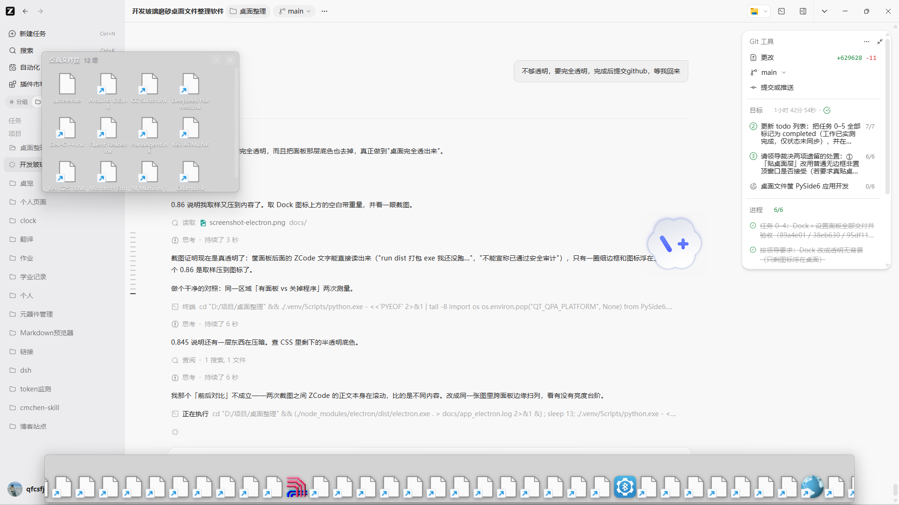

# DeskBasket · 桌面文件筐 ＋ 底部 Dock

把桌面上散落的文件、文件夹、快捷方式收进玻璃/透明的面板里分类摆放；面板里的项目双击就能打开，右键文件夹还能钻进一个内置的"类资源管理器"页面逐级往下看。屏幕底部有一条常驻的常用软件栏（Dock），固定贴在桌面底部。

**技术栈：Electron（与 `D:\项目\token监测` 同架构）。** 之前的 Python/Qt 实现保留在仓库里（标签 `v2.2.0-python`），但不再是主线——原因见下面「为什么从 Qt 换成 Electron」。

Windows 11 实测通过（build 26200.9445）。



## 先说最重要的一条：它不动你的文件

**面板只登记文件的绝对路径，绝不移动、删除、改名、改属性。** 桌面上原来的图标、位置、时间戳全都保持原样，筐是一层"分类视图 + 启动面板"，不是收纳盒。

## 两种透明度模式

设置面板里可切换，改完会**重建窗口**立即生效（Electron 的透明与材质参数在窗口创建时锁定，只能重建）。

| 模式 | 实现 | 实测透光比 | 观感 |
|---|---|---|---|
| **完全透明**（默认） | `transparent: true`，不挂材质；页面不铺任何底色，只留一圈细边框 ＋ 文字阴影 | **1.000** | 桌面完全透出来，零衰减 |
| **磨砂玻璃** | `transparent: false` + `backgroundMaterial: 'acrylic'` | 0.86（糊化 0.09） | 背后内容被糊开，是真磨砂 |
| 轻量模糊 | 老 API `BLURBEHIND` | 0.60 | 部分系统上会偏暗 |

**透光比怎么测的**：透明度必须用**纯色背板**量，不能拿真实桌面当参照——真实桌面内容不均匀，跨着面板边缘取样会得出假数值（我一开始就因此得出 0.85 的错误结论，还以为窗口在压暗）。做法是 `tools/opacity-meter.js`：先铺一块自己控制的 120 灰度背板，再把透明面板盖上去，比较面板内外：

```
纯色背板亮度        120.0
面板内亮度          120.0
面板外(同背板)亮度  120.0
→ 透光比 1.000 （1.00 = 完全透明）
```

## 窗口行为（与 token 监测的 `windowBehavior` 同一套）

token 有三个模式，本程序直接沿用同一套 profile 与语义，设置面板里可分别给「文件筐」和「Dock」选：

| 模式 | 置顶 | 可拖动 | 可缩放 | 本程序用途 |
|---|---|---|---|---|
| `floating` 浮动置顶 | ✅ | ✅ | ✅ | 想让它浮在其他窗口上方时选 |
| `normal` **普通窗口** | ❌ | ✅ | ✅ | **文件筐默认**：可聚焦、进任务栏、可缩放最小化、双击标题条最大化 |
| `desktop` **固定于桌面** | ❌ | ❌ | ❌ | **Dock 默认**：固定在桌面底部居中，不可拖走、不可缩放、不置顶 |

注意 `desktop` 在这套实现里**不是置顶**、也不用 Win32 的 z 序技巧——就是「不置顶 ＋ 不能拖 ＋ 不能缩放 ＋ 带 `desktop-mode` 类」，这与 token 完全一致。真机核对（窗口扩展样式）：

```
DeskBasket Dock  EX=0x00200100  置顶=False 工具窗=False NOREDIR=True   ← desktop 模式
文件筐            EX=0x00200100  置顶=False 工具窗=False NOREDIR=True   ← normal 模式
```

## 功能

- **文件筐**：按领导要求做成**普通窗口**——可聚焦、进任务栏、可缩放最小化、双击标题条最大化；位置大小持久化，重启后回到原处。
- **底部 Dock**：**固定于桌面**底部居中，**常驻显示不收起来**（鼠标移开也不收起），不占屏幕空间、不会被拖走。
  - 自动收录桌面上的 `.lnk` / `.url` / `.exe`；也可以直接把任意文件、文件夹拖进去。
  - 拖动图标调整顺序并持久化；右键「从 Dock 移除」只去掉登记，磁盘文件不动，而且**移除过的不会再被自动收录加回来**。
  - 悬停时图标放大、名称浮在上方（Nexus 的做法）；前台是全屏程序（视频/游戏/演示）时自动让位，桌面与最大化窗口不算全屏。
- **内置文件浏览器**：可点面包屑、返回、上一级（已在根目录时置灰），双击文件夹继续深入；只读遍历、零写操作，大目录分批渲染。
- **托盘常驻**：显示所有筐、新建筐、显示/隐藏 Dock、Dock 常驻开关、设置、开机自启、退出。
- **单实例**：重复启动会被挡下，避免两条 Dock 抢同一份配置。
- **开机自启**：写 `HKCU\...\CurrentVersion\Run`，值名 `DeskBasket`，开关幂等。

## 快速开始

```bash
npm install                 # 装依赖（Electron 二进制走 npmmirror 镜像，实测 6.4 MB/s）
npm start                   # 启动
npm test                    # 跑纯逻辑单测（node --test，31 条）
```

> 本机的 npm 11 有 `allow-scripts` 策略，会跳过 Electron 的下载脚本。换机器时若 `node_modules/electron/dist` 为空，手动补一次二进制：
> ```bash
> curl -L -o /tmp/e.zip https://npmmirror.com/mirrors/electron/43.2.0/electron-v43.2.0-win32-x64.zip
> python -c "import zipfile;zipfile.ZipFile('/tmp/e.zip').extractall('node_modules/electron/dist')"
> echo electron.exe > node_modules/electron/path.txt
> ```

打包成免安装 exe：

```bash
npm run dist                # electron-builder --win portable，产物在 dist/
```

## 目录结构

```
package.json            Electron 工程（main / scripts / build 配置）
src/main/main.js        主进程：窗口编排、托盘、IPC、自启、Dock 位置
src/main/windows.js     窗口工厂（透明模式 / 磨砂模式、普通窗口 / 挂件窗口）
src/main/preload.js     渲染层能用的 API（走 contextBridge，页面不碰 Node）
src/main/store.js       配置持久化（%APPDATA%\DeskBasket\settings.json，原子写、未知字段保留）
src/main/baskets.js     筐数据模型（纯函数）
src/main/dockmodel.js   Dock 纯逻辑（热区、全屏判定、位置、收录、排序）
src/main/filebrowse.js  目录列举（只读，异常转中文提示）
src/main/autostart.js   开机自启（注册表）
src/renderer/*.html     basket / dock / explorer / settings 四个页面
src/renderer/common.css 共用样式（半透明面板、两行名称截断、悬停放大）
src/renderer/menu.js    页面内右键菜单（Electron 里 window.prompt 不可靠）
tests/core.test.js      31 条纯逻辑单测
tools/glass-probe.js    玻璃探针：把几种透明/材质配置并排显示，用于真机比对
docs/                   截图与实测取证
```

Python/Qt 版（历史版本）的实现文件仍在仓库根目录（`main.py`、各窗口模块、`build.ps1` 等）。要取回那份干净布局，用标签 `v2.2.0-python`。

## 开发约定

- **只读桌面**：`store.js` / `baskets.js` / `dockmodel.js` / `filebrowse.js` 里没有任何写文件的代码路径；"移除条目""清理失效项"都只动数据，单测里有断言守着。
- **不许静默失败**：打开文件失败会弹中文提示；目录读不了返回中文原因并保持当前目录不变。
- **坐标系不许混用**：Dock 的热区与位置全部用 Electron 的屏幕逻辑像素（`screen.getPrimaryDisplay().bounds`）。
- **界面改动必须真机截图核对**：单测全绿不等于界面对——上一版就吃过"测试全绿但面板渲染成黑块""子控件 parent 为 None 导致图标不上屏"的亏。

## 为什么从 Qt 换成 Electron

上一版是 Python + PySide6。卡住的根因是**透明窗口的合成方式**：

- Qt 的 `WA_TranslucentBackground` 走 Windows **分层窗口**（`WS_EX_LAYERED`）。给这种窗口挂 DWM 磨砂材质，实测会渲染成几乎不透明的**黑块**（面板空白区亮度 17/255），而且 Qt 自己画的内容完全参与不到合成里（面板底色 alpha 0x00 与 0x60 结果一模一样）。
- Electron/Chromium 用 `WS_EX_NOREDIRECTIONBITMAP` + DirectComposition，实测同样的材质出来是**真磨砂玻璃**：透光 0.86、高频削掉 91%，不是黑块。

也就是说，"跟 token 一样"不只是换语言，而是换掉了整套窗口合成路径。实测数据、失败清单与取舍记录都在 [PROGRESS.md](PROGRESS.md) 与 [BLOCKED.md](BLOCKED.md) 里。

## 已知限制

1. **Dock 的两种显示模式**（设置里切换）：
   - **常驻显示**：Dock 放在**桌面层**——桌面之上、所有应用窗口之下。桌面露出来时看得见，任何窗口盖住底部时它就在后面（不会压在其他程序上面）。做法是启动后按 z 序**逐步下沉**，直到"紧挨在它下面的窗口是桌面层"为止（见 `src/main/windowLayer.js`）。
   - **自动收起**（默认）：鼠标不在附近时滑到屏幕外，碰一下底边再滑出来；这个模式下它保持置顶，好盖得住同样贴底边的任务栏。
   两条弯路记在这里：`HWND_BOTTOM` 之类直接把窗口压到最底会掉到**壁纸层下面**（`IsWindowVisible` 为真但看不见）；往"前台窗口"之后插则可能把 Dock **变成置顶**（`SetWindowPos` 把非置顶窗口插到置顶窗口之后会提升它），所以插入点只取 z 序邻居。
2. **常驻模式下 Dock 与自动隐藏的任务栏在底部会视觉重叠**：Dock 贴屏幕底边且不再置顶，任务栏弹出来时（它是置顶的）会盖住 Dock 的图标。想彻底避开就得改用 AppBar 预留空间，但那样桌面可用高度会永久减少约 40 像素。
3. **开机自启只在 Windows 上实现**（注册表 Run 值）。
4. **日志里那条 `WSALookupServiceBegin failed with: 10108` 是无害的**，可以忽略：它来自 Electron 内置的 Chromium 网络模块（`net/base/network_change_notifier_win.cc`），不是本项目代码。10108 是 `WSASERVICE_NOT_FOUND`（系统原话："在指定的命名空间中找不到这个服务"）——Chromium 想用 Winsock 命名空间服务来监听网络变化，在这台机器上这个查询失败（蓝牙硬件与 `bthserv` 都在，是那条查询路径本身不可用），于是它退回到其它变更通知方式。对 DeskBasket 没有任何影响（它全程只做本地文件与 shell 调用，不依赖网络状态）。不建议为了消掉它去调低 Chromium 的日志级别——那会把真正的报错一起静音，违背本项目"出问题要看得见"的约定。

## 版本与回退

仓库历史**没有改写过**（无 force-push、无 rebase 掉已有提交），每个提交都是可用的完整状态。

| 标签 | 内容 |
|---|---|
| `v1.0.0` | 第一轮交付（Python/Qt）：磨砂文件筐、内置浏览器、开机自启、单文件 exe |
| `v2.0.0` | 第二轮交付（Python/Qt）：底部 Dock、设置面板、单实例保护 |
| `v2.1.0` | 外观返工（Python/Qt）：悬停放大、玻璃承托条、两行名称不裁字 |
| `v2.2.0-python` | **最后一版 Python/Qt 实现**（改用 Electron 之前的完整状态） |

回退姿势：

```bash
git show v2.2.0-python:main.py       # 只看某个文件
git switch --detach v2.2.0-python    # 临时回到 Python 版（不丢后面的提交，试完 git switch main）
git revert <提交号>                   # 只撤掉某一次改动
```

## 许可

[MIT](LICENSE) © 2026 cmchen
